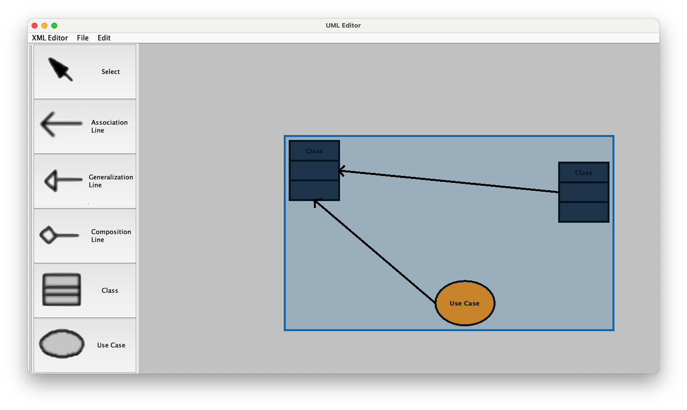

# UML Editor



## How to build and run the project

```bash
# Clone the repository
$ git clone git@github.com:1chooo/uml-editor.git

$ ./scripts/run.sh
```

## Diagram

Generated by [gitdiagram](https://github.com/ahmedkhaleel2004/gitdiagram).

```mermaid
flowchart TD
    %% Application Entry
    subgraph "Application Entry"
        Main["Main.java"]:::entry
    end

    %% User Interface (UI)
    subgraph "User Interface (UI)"
        UMLEd["UMLEditor"]:::ui
        Canvas["Canvas"]:::ui
        MenuBar["MenuBar"]:::ui
        SidePanel["SidePanel"]:::ui
    end

    %% Event Handling
    subgraph "Event Handling"
        MBL["MenuBarListener"]:::event
    end

    %% Modes and Operations
    subgraph "Modes"
        ModeInt["Mode Interface"]:::mode
        SelectM["SelectMode"]:::mode
        CreateShapeM["CreateShapeMode"]:::mode
        CreateLineM["CreateLineMode"]:::mode
    end

    %% Domain Model (UML Shapes)
    subgraph "Domain Model (UML Shapes)"
        Basic["BasicObject"]:::domain
        ClassObj["ClassObject"]:::domain
        UseCaseObj["UseCaseObject"]:::domain
        Assoc["AssociationLine"]:::domain
        Comp["CompositionLine"]:::domain
        Gen["GeneralizationLine"]:::domain
        Lnode["Line"]:::domain
        PortNode["Port"]:::domain
        ShapeNode["Shape"]:::domain
        GroupNode["Group"]:::domain
    end

    %% Utilities and Configuration
    subgraph "Utilities/Config"
        Config["CONFIG"]:::utils
        Helper["HELPER"]:::utils
        ModesUtil["MODES"]:::utils
        RenameObj["RenameObject"]:::utils
        WarningUtil["Warning"]:::utils
    end

    %% Connections between layers
    Main -->|"launches"| UMLEd
    UMLEd -->|"contains"| Canvas
    UMLEd -->|"contains"| MenuBar
    UMLEd -->|"contains"| SidePanel
    MenuBar -->|"triggers"| MBL
    MBL -->|"selects"| ModeInt
    ModeInt -->|"implements"| SelectM
    ModeInt -->|"implements"| CreateShapeM
    ModeInt -->|"implements"| CreateLineM

    %% Modes interacting with Domain Model
    SelectM -->|"updates"| ClassObj
    CreateShapeM -->|"creates"| Basic
    CreateLineM -->|"draws"| Assoc
    %% Additional domain updates
    SelectM -->|"manages"| UseCaseObj
    CreateLineM -->|"draws"| Gen

    %% Domain Model renders on UI
    Basic -->|"renders on"| Canvas
    ClassObj -->|"renders on"| Canvas
    UseCaseObj -->|"renders on"| Canvas
    Assoc -->|"renders on"| Canvas
    Comp -->|"renders on"| Canvas
    Gen -->|"renders on"| Canvas
    Lnode -->|"renders on"| Canvas
    PortNode -->|"renders on"| Canvas
    ShapeNode -->|"renders on"| Canvas
    GroupNode -->|"renders on"| Canvas

    %% Utilities supporting Modes and Domain
    Config -->|"configures"| CreateShapeM
    Helper -->|"assists"| SelectM
    ModesUtil -->|"defines"| ModeInt
    RenameObj -->|"renames"| ClassObj
    WarningUtil -->|"alerts"| SelectM

    %% Styles
    classDef entry fill:#87CEFA,stroke:#000,stroke-width:1px;
    classDef ui fill:#ADD8E6,stroke:#000,stroke-width:1px;
    classDef event fill:#90EE90,stroke:#000,stroke-width:1px;
    classDef mode fill:#DDA0DD,stroke:#000,stroke-width:1px;
    classDef domain fill:#FFA500,stroke:#000,stroke-width:1px;
    classDef utils fill:#D3D3D3,stroke:#000,stroke-width:1px;

    %% Click Events
    click Main "https://github.com/1chooo/uml-editor/blob/main/src/Main.java"
    click UMLEd "https://github.com/1chooo/uml-editor/blob/main/src/views/UMLEditor.java"
    click Canvas "https://github.com/1chooo/uml-editor/blob/main/src/components/Canvas.java"
    click MenuBar "https://github.com/1chooo/uml-editor/blob/main/src/components/MenuBar.java"
    click SidePanel "https://github.com/1chooo/uml-editor/blob/main/src/components/SidePanel.java"
    click MBL "https://github.com/1chooo/uml-editor/blob/main/src/listener/MenuBarListener.java"
    click ModeInt "https://github.com/1chooo/uml-editor/blob/main/src/modes/Mode.java"
    click SelectM "https://github.com/1chooo/uml-editor/blob/main/src/modes/SelectMode.java"
    click CreateShapeM "https://github.com/1chooo/uml-editor/blob/main/src/modes/CreateShapeMode.java"
    click CreateLineM "https://github.com/1chooo/uml-editor/blob/main/src/modes/CreateLineMode.java"
    click Basic "https://github.com/1chooo/uml-editor/blob/main/src/shapes/BasicObject.java"
    click ClassObj "https://github.com/1chooo/uml-editor/blob/main/src/shapes/ClassObject.java"
    click UseCaseObj "https://github.com/1chooo/uml-editor/blob/main/src/shapes/UseCaseObject.java"
    click Assoc "https://github.com/1chooo/uml-editor/blob/main/src/shapes/AssociationLine.java"
    click Comp "https://github.com/1chooo/uml-editor/blob/main/src/shapes/CompositionLine.java"
    click Gen "https://github.com/1chooo/uml-editor/blob/main/src/shapes/GeneralizationLine.java"
    click Lnode "https://github.com/1chooo/uml-editor/blob/main/src/shapes/Line.java"
    click PortNode "https://github.com/1chooo/uml-editor/blob/main/src/shapes/Port.java"
    click ShapeNode "https://github.com/1chooo/uml-editor/blob/main/src/shapes/Shape.java"
    click GroupNode "https://github.com/1chooo/uml-editor/blob/main/src/shapes/Group.java"
    click Config "https://github.com/1chooo/uml-editor/blob/main/src/utils/CONFIG.java"
    click Helper "https://github.com/1chooo/uml-editor/blob/main/src/utils/HELPER.java"
    click ModesUtil "https://github.com/1chooo/uml-editor/blob/main/src/utils/MODES.java"
    click RenameObj "https://github.com/1chooo/uml-editor/blob/main/src/utils/RenameObject.java"
    click WarningUtil "https://github.com/1chooo/uml-editor/blob/main/src/utils/Warning.java"
```



## CONTACT INFO.

> AWS Educate Cloud Ambassador, Technical Support </br>
> **Hugo ChunHo Lin**
> 
> <aside>
>   📩 E-mail: <a href="mailto:hugo970217@gmail.com">hugo970217@gmail.com</a>
> <br>
>   🧳 Linkedin: <a href="https://www.linkedin.com/in/1chooo/">Hugo ChunHo Lin</a>
> <br>
>   👨🏻‍💻 GitHub: <a href="https://github.com/1chooo">1chooo</a>
>    
> </aside>

## License
Released under [MIT](./LICENSE) by [Hugo ChunHo Lin](https://github.com/1chooo).

This software can be modified and reused without restriction.
The original license must be included with any copies of this software.
If a significant portion of the source code is used, please provide a link back to this repository.
