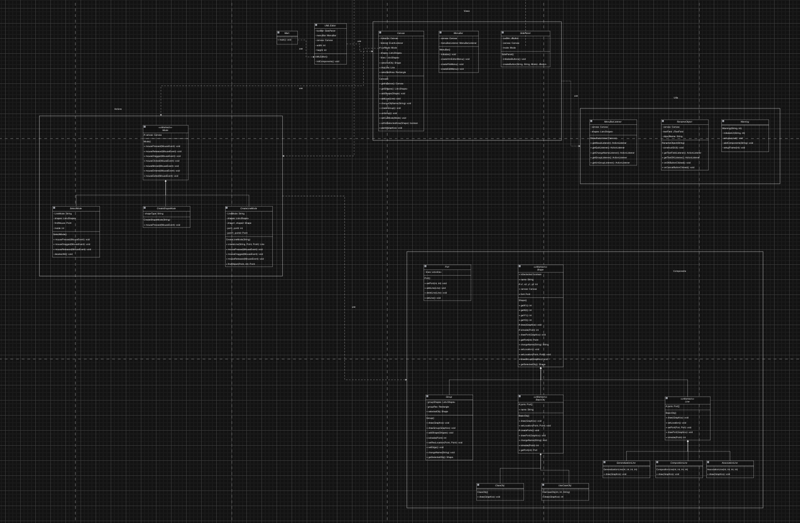
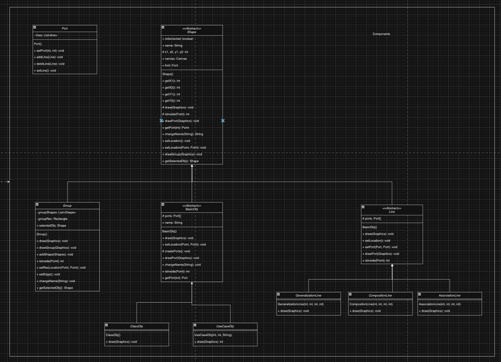
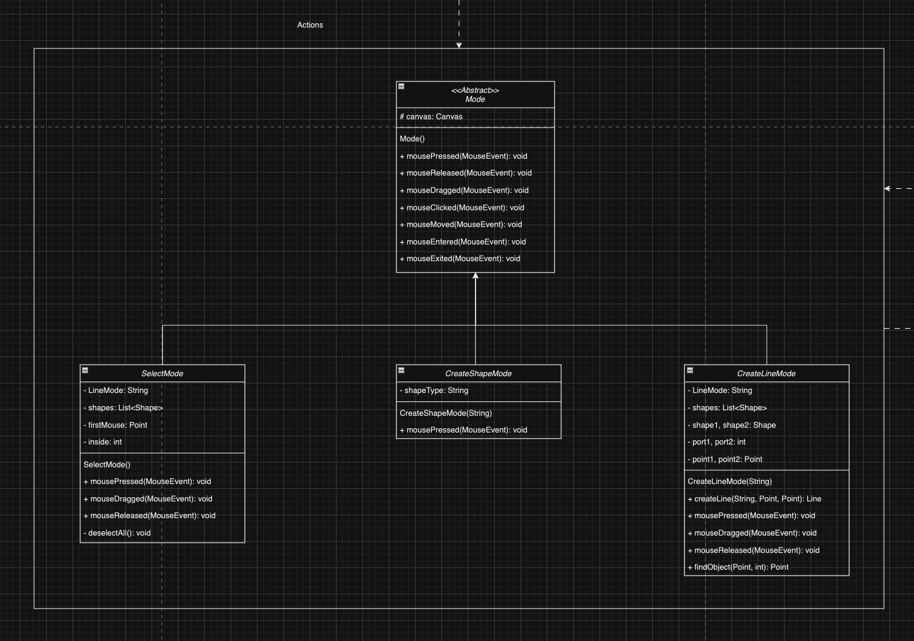
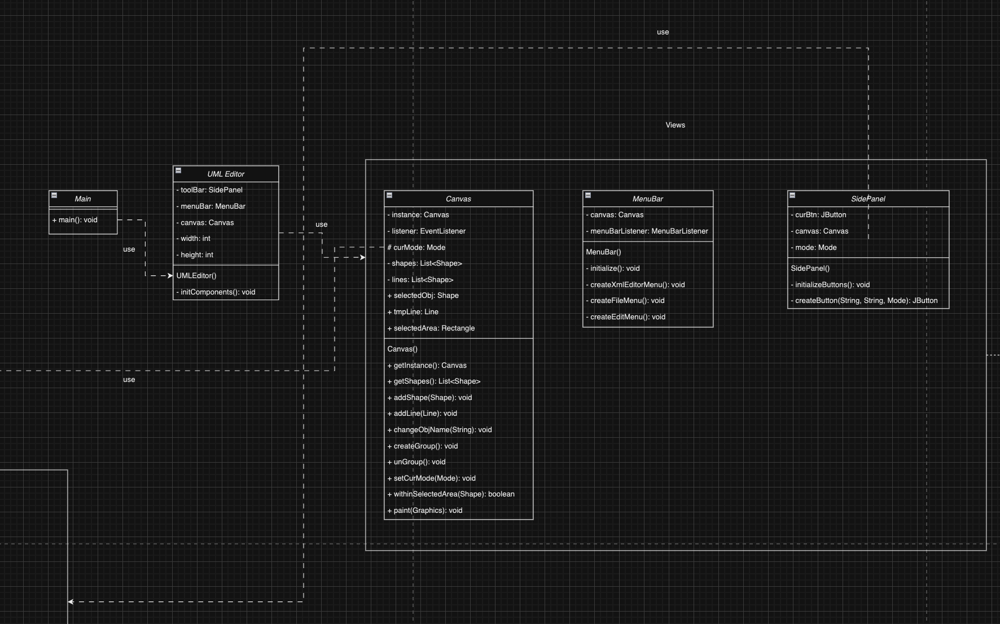
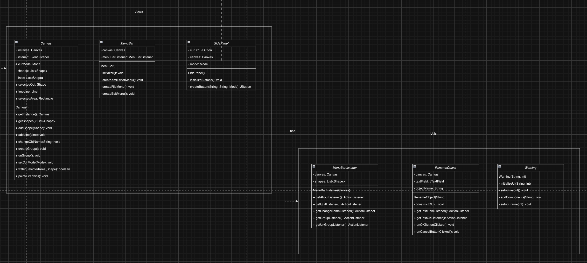

# Class Diagram

採用 MVC 架構嗎！？目前改到無力的點是很多功能在一開始都被我綁在 Canvas 了！改不動，但又花了很多時間構思，卻發現現有解法在未來擴充性上，不知道會出什麼問題，就是目前感覺不會碰到一直 copy-paste 的情況發生，或許真的要把每個 Side Panel 裡的 Button 都能獨立成 Class，這樣才能達到真正的擴充性，但以目前設計來說又跟畫出圖形勢衝突的，所以想跟助教討論看看，或許有更好的解法。

另外老師在軟體工程有提及寫 "測試" 的重要性，然而現有的專案，要怎麼做單元測試，甚至是其他的測試因為涉及使用者介面，會有多個使用情境，因為目前沒有太多經驗因此想詢問。

當時 Lab 提出的討論：
1. [Fixed] 畫完全部的流程圖後，真的如助教當時所說的，有些繼承的關係是可以再精進的，尤其是我在畫 components 的時候，components 之間的關係很細分，但是沒有好好使用到多型，很多 class 都根據基底 class 要多宣告一次記憶體，我覺得這可以修正。
2. [Hard!!!] 在 Views 區塊有大量區域都要宣告 canvas 以及 Action 都需要使用到 canvas 的初始，也就是有太多功能依賴著 canvas 或許我可以把他拉出來變成獨立的 Action 去控制，不然就失去封裝的意義。
3. [Fixed] 我有很多 class 的 variable 一下宣告 public, 一下宣告 protected 但是在 subclass 我又宣告一次，這樣等於沒有善用繼承的結果，是可以修正的。 

其他當時助教的建議：

1. 把目前宣告成 `String` 的 `vars` 改成 `enum`。
2. 避免出現 `i--` 的情況，會在未來不知道要做什麼。
   1. 我想衍生出 Shapes 那邊的 plot 或許可以分開來畫，把每個運算都包成 private function。（努力中，因為目前不影響繼承的物件關係）

## Components

## Actions

## Views

## Utils

